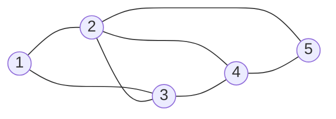

# Chapter 11: Bron-Kerbosch

The Bron-Kerbosch algorithm finds every maximal clique in an undirected graph. A clique is a set of vertices where every pair is connected. A maximal clique cannot be extended by adding another adjacent vertex.

The implementation is available in [`code/bron_kerbosch.py`](../../code/bron_kerbosch.py). Run it from the repository root with:

```text
python code/bron_kerbosch.py
```

## Graph Example

The example below contains overlapping maximal cliques. The shared vertices make it useful for seeing how the recursive search narrows its candidate set.



The maximal cliques are `[1, 2, 3]`, `[2, 4, 5]`, and `[2, 3, 4]`.

## Pseudocode

```text
Input:
	R: vertices currently forming the clique
	P: candidate vertices that can extend R
	X: already-evaluated vertices used to avoid duplicates

Output:
	All maximal cliques containing R, using vertices from P,
	and no vertices from X

BRON-KERBOSCH(R, P, X):
	If P is empty and X is empty:
		Output R as a maximal clique
		Return

	For each vertex v in a copy of P:
		neighbors_v = neighbors of v
		new_R = R union {v}
		new_P = P intersection neighbors_v
		new_X = X intersection neighbors_v

		BRON-KERBOSCH(new_R, new_P, new_X)

		P = P minus {v}
		X = X union {v}
```

## Class Initialization and Graph Setup

The graph uses an adjacency list represented by a dictionary of sets. Sets make the candidate and excluded intersections concise and efficient.

```python
from collections import defaultdict


class BronKerbosch:
	def __init__(self):
		self.graph = defaultdict(set)
		self.maximal_cliques = []

	def add_edge(self, u, v):
		self.graph[u].add(v)
		self.graph[v].add(u)
```

## Standard Recursive Algorithm

```text
BRON-KERBOSCH(R, P, X):
	If P is empty and X is empty:
		Add R to the maximal cliques
		Return

	For each vertex v in a copy of P:
		neighbors = neighbors of v
		BRON-KERBOSCH(
			R union {v},
			P intersection neighbors,
			X intersection neighbors
		)
		Remove v from P
		Add v to X
```

The algorithm iterates over a copy of `P` because the original candidate set is updated after each recursive branch. Moving a processed vertex from `P` to `X` prevents the same maximal clique from being reported again.

## Pivot Optimization

For dense graphs, the implementation also supports the pivoting optimization. A pivot is selected from `P union X`, and recursion is attempted only for candidates in `P` that are not neighbors of the pivot:

```text
BRON-KERBOSCH-WITH-PIVOT(R, P, X):
	If P is empty and X is empty:
		Add R to the maximal cliques
		Return

	Choose pivot u from P union X

	For each vertex v in P minus neighbors(u):
		BRON-KERBOSCH-WITH-PIVOT(
			R union {v},
			P intersection neighbors(v),
			X intersection neighbors(v)
		)
		Remove v from P
		Add v to X
```

Call `find_maximal_cliques(use_pivot=False)` to run the standard algorithm or use the default `True` value for the pivoted version. The module includes examples of both.

