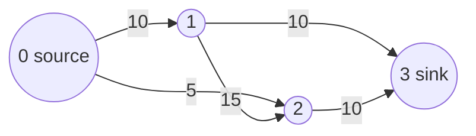

# Chapter 10: Push-Relabel

The push-relabel algorithm computes a maximum flow in a directed graph with capacities. It first creates a preflow by saturating the edges leaving the source. Vertices that receive more flow than they can send onward hold this amount as excess. The algorithm repeatedly pushes excess along admissible residual edges or relabels a vertex when no such edge is available.

The implementation is available in [`code/push_relabel.py`](../../code/push_relabel.py). Run it from the repository root with:

```text
python code/push_relabel.py
```

## Book Example

The source is vertex `0` and the sink is vertex `3`:



The maximum flow is `15`.

## Pseudocode

```text
Initialize graph state:
	For every edge (u, v), set flow[u][v] = 0
	Set height[source] = |V| and height[u] = 0 for every u != source
	Set excess[u] = 0 for every vertex u

For every neighbor v of source:
	Push the full capacity from source to v
	Add that capacity to excess[v]

While there is an active vertex u where u != source, u != sink,
and excess[u] > 0:
	If a residual neighbor v satisfies height[u] = height[v] + 1:
		PUSH(u, v)
	Otherwise:
		RELABEL(u)

PUSH(u, v):
	residual = capacity[u][v] - flow[u][v]
	amount = min(excess[u], residual)
	flow[u][v] += amount
	flow[v][u] -= amount
	excess[u] -= amount
	excess[v] += amount

RELABEL(u):
	Find the minimum height of a residual neighbor of u
	Set height[u] = minimum neighbor height + 1

Return excess[sink]
```

## Python Implementation Notes

`capacity` stores the original directed capacities, while `flow` stores the current skew-symmetric flow. A negative value in `flow[v][u]` represents residual capacity that can cancel flow previously sent from `u` to `v`. The runnable file includes the book graph and two additional examples.

